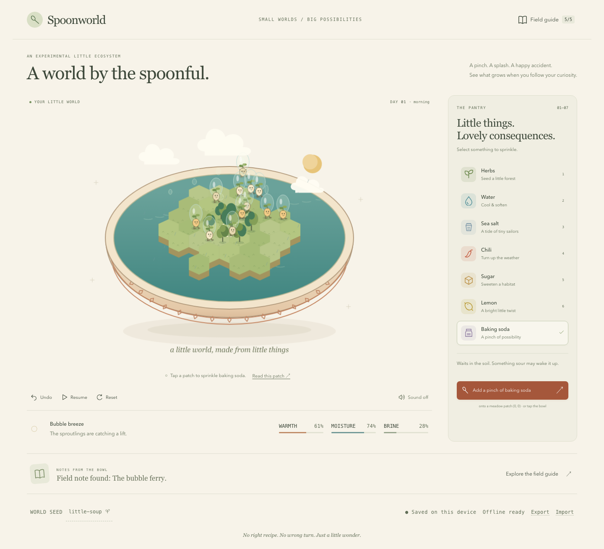

# Spoonworld

A tiny ingredient ecology toy, served in a ceramic bowl. Sprinkle a pantry ingredient onto a patch and watch the roots, weather, seas, and twelve little sproutlings respond. Follow five field-guide clues to find herb woods, shell sailors, kitchen rain, glowbug meadows, and bubble ferries.

Source is maintained in the private repository [aranlucas/spoonworld](https://github.com/aranlucas/spoonworld). Clone with `git clone https://github.com/aranlucas/spoonworld.git`.



## Run

Requires Node.js 22.12+ or 24+ and npm. No account, backend, AI provider, or API key.

```sh
npm ci
npm run build
npm start
```

Open **http://127.0.0.1:4188**. The production build precaches all its own assets. Once **Offline ready** appears, reload and play without network access. Service workers require localhost or HTTPS. Development uses `npm run dev` at **https://spoonworld.localhost**; its unbuilt server does not install the offline cache.

The portable app ZIP includes the built `dist/` directory. Unzip it and run `node scripts/serve.mjs`; no package installation is needed to play that bundle.

### Development URL with Portless

The normal `npm run dev` command uses
[Portless](https://github.com/vercel-labs/portless/tree/v0.15.7) for a stable local URL.
Install its CLI once with **Node.js 24 or newer** (within this project's supported
range), then run:

```sh
npm install -g portless@0.15.7
npm run dev
```

Open **https://spoonworld.localhost** with the default proxy settings.
Portless starts its shared proxy automatically. Its first HTTPS run creates and
trusts a local certificate authority and may prompt for administrator privileges
to bind port 443 or update local hostname entries. Start it from an interactive
terminal and review those prompts. `portless doctor` diagnoses local setup issues.

Portless supplies Vite with a free port, a loopback host, and `--strictPort`.

Linked Git worktrees receive a branch-name prefix, such as
`https://fix-ui.spoonworld.localhost`; use the URL Portless prints.
Use `npm run dev:direct` to run the original localhost server without Portless.

Browser storage and offline caches belong to each origin. Existing data at a
numbered localhost URL stays there; use the app's export/import flow when available
to move data to the named URL.

## Play

- Pick an ingredient, then tap a patch. Nearby patches receive a lighter dose. **Add a pinch** uses the last chosen patch.
- **Field guide** gives five gentle clues, then records discoveries and explains their causes.
- **Read this patch** opens a text notebook for all 61 patches. Pick a patch, read its moisture and salt conditions, sprinkle with native controls, and undo to compare. Ecology pauses while it is open.
- **Meet your twelve neighbours** in the field guide gives each sproutling a name and a short observation based on its current habitat or travel mode. Visit its home patch straight from the note.
- **Undo** restores the exact world before the last ingredient addition, seed change, reset, or import. Keeps twelve snapshots.
- **Pause** holds the ecology still while you experiment. Decorative movement continues. Opening a notebook or seed dialog also holds the ecology.
- **Reset** recreates the current seeded island and can be undone. Click the seed name for a different island.
- **Export/Import** moves a world and its field notes between browsers. Import also retains the exported undo history and puts the previous bowl first in the undo sequence.
- Keys **1–7** select pantry items. Focus the bowl, use **arrow keys** to choose a patch, and **Enter** to sprinkle. **Space** pauses; **Z** undoes.
- Sound starts off. The sound button enables short, locally synthesized notes after a user gesture.

All data stays in this browser’s local storage. Ingredients are synthetic; there is no private data access or external service call. This is a whimsical toy, with deliberately simplified fictional ecology.

## Verify

```sh
npm test
npx playwright install chromium
npm run build
npm run test:browser
npm run format:check
```

Browser tests use a single worker and temporary browser contexts. For an installed Chrome, use `PLAYWRIGHT_CHANNEL=chrome npm run test:browser`. The suite starts and stops only its own local server on port 4188.

Tests cover seeded reproducibility, batch-equivalent fixed ticks, five discoveries, salt stress and water recovery, 3,000 randomized actions, save validation, import/export, corrupt-save recovery, quota failure/retry, exact undo/reset/persistence, offline reload, genuine emulated touch, keyboard/reduced motion, responsive layouts, frame budgets, and axe WCAG A/AA checks. See [QA.md](QA.md) and `evidence/` for measured results and limits.

## Structure and resource bounds

- `src/simulation.js`: pure deterministic state transitions; 61 fixed patches and 12 inhabitants.
- `src/storage.js`: bounded, validated save schema and recoverable storage operations.
- `src/renderer.js`: original procedural artwork in one Phaser Canvas scene; native pointer input, a 960×640 canvas, 30 FPS target, at most 48 sprinkle particles.
- `src/main.js`: DOM controls, notebook, keyboard mapping, fixed one-second ecology clock, persistence. Hidden tabs suspend the world; there is no offline time catch-up.
- `src/naturalist.js`: named residents and readable patch observations derived from current simulation rules. No additional saved state or text generation service.
- `scripts/build-offline.mjs`: generates a content-versioned precache from every production asset. Only this app’s own cache names are cleaned up.
- `scripts/serve.mjs`: dependency-free static server with content types and a restrictive content security policy.

Art, ingredient icons, sproutlings, bowl decoration, and sound were made for this project in code. No downloaded art or generated provider assets. Phaser 3.90.0 is pinned as an established 2D runtime; Vite, Playwright, axe, and Prettier are development tools. The lockfile pins all resolved registry packages.

## Hosting configuration

`railway.json` builds the static bundle and runs the server using Railway’s `PORT`, binding to `0.0.0.0`. `wrangler.jsonc` points Cloudflare Workers static assets at `dist/`; Cloudflare Pages can also use build command `npm run build`, output directory `dist`.

No infrastructure has been provisioned and no public release has been performed. Deployment requires a deliberate later action. See [DECISIONS.md](DECISIONS.md) for the research brief and next experiments.

To regenerate the portable source, Git bundle, and built-app archives from a clean committed checkout, run `npm run build` followed by `python3 scripts/package.py` (Python 3 and Git are needed only for packaging).
